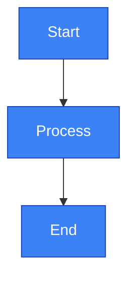

# Documentation Guidelines for AI Agents

This file provides instructions for AI agents (like Claude Code) when working with documentation in the `/docs` directory.

## Diagram Management Standards

### CRITICAL RULE: No Inline Mermaid Diagrams

**NEVER** add inline mermaid diagrams directly in documentation markdown files. All diagrams MUST follow the standardized diagram repository pattern.

### The Correct Approach

When documentation needs a diagram, follow this workflow:

#### 1. Create the Mermaid Source File

**Location:** `/docs/diagrams/source/{category}-{number}-{description}.mmd`

**Naming Convention:**
- `{category}` - One of: architecture, flow, state, comparison, deployment, data, integration
- `{number}` - Two-digit sequential number within category (01, 02, etc.)
- `{description}` - Kebab-case descriptive name

**Find the Next Available Number:**
```bash
# Check last number in category
ls -1 docs/diagrams/source/architecture-*.mmd | tail -1
# If architecture-20 exists, use architecture-21
```

**Example Filenames:**
- `architecture-21-api-gateway-flow.mmd`
- `flow-16-authentication-sequence.mmd`
- `state-05-deployment-lifecycle.mmd`
- `data-07-user-schema.mmd`

#### 2. Write the Mermaid Code

Create the `.mmd` file with proper mermaid syntax:



**Standard Color Palette:**
```
Primary (Blue):    fill:#3b82f6,stroke:#1e40af,color:#fff
Success (Green):   fill:#10b981,stroke:#059669,color:#fff
Warning (Amber):   fill:#f59e0b,stroke:#d97706,color:#fff
Error (Red):       fill:#ef4444,stroke:#dc2626,color:#fff
Info (Purple):     fill:#8b5cf6,stroke:#6d28d9,color:#fff
```

**Best Practices:**
- Test syntax at https://mermaid.live/ before committing
- Keep diagrams under 20 nodes (split complex diagrams)
- Use descriptive labels (no abbreviations)
- Add subgraphs for logical grouping
- Apply consistent styling with classDef

#### 3. Generate the SVG

**Using the generation script:**
```bash
cd docs/diagrams
./generate-all.sh
```

**Or generate a single diagram:**
```bash
cd docs/diagrams
mmdc -i source/architecture-21-api-gateway-flow.mmd \
     -o architecture-21-api-gateway-flow.svg \
     -t default \
     -b transparent
```

**Verify the SVG was created:**
```bash
ls -lh docs/diagrams/architecture-21-api-gateway-flow.svg
```

#### 4. Reference the Diagram in Documentation

**Standard Markdown Image Syntax:**
```markdown

```

**Example:**
```markdown
## API Gateway Architecture


The API gateway acts as the single entry point...
```

**Alt Text Guidelines:**
1. Start with diagram type (Architecture Diagram, Sequence Diagram, State Machine, etc.)
2. Describe the topic/subject
3. Summarize key elements and relationships
4. Keep it concise (60-150 characters)

**Path Rules:**
- Use relative paths: `diagrams/filename.svg`
- Paths are relative from the markdown file location
- For files in `/docs/*.md`, use `diagrams/filename.svg`
- For files in `/docs/subdirectory/*.md`, use `../diagrams/filename.svg`

#### 5. Optional: Create Diagram Documentation

For complex or important diagrams, create a documentation page:

**Location:** `/docs/diagrams/{filename}.md`

**Template:**
```markdown
# {Diagram Title}

## Overview

Brief description of what this diagram represents.

## Diagram


## Components

### Component 1
Description of this component and its role.

### Component 2
Description of this component and its role.

## Data Flow

1. Step 1: Description
2. Step 2: Description
3. Step 3: Description

## Related Diagrams

- [{Related Diagram Name}](filename.md)
```

#### 6. Update Navigation (If Applicable)

If using sidebar navigation (`docs/_sidebar.md`):

```markdown
* Architecture
  * [MVC Request Flow](diagrams/architecture-20-mvc-request-flow.md)
  * [API Gateway Flow](diagrams/architecture-21-api-gateway-flow.md)
```

## Common Diagram Categories

### Architecture Diagrams (`architecture-XX-`)
System design, component relationships, layers, modules

**Use for:**
- System overviews
- Component architecture
- Layer diagrams
- Module organization

**Diagram Types:** Flowchart, graph TB/LR

### Flow Diagrams (`flow-XX-`)
Request flows, sequences, workflows, processes

**Use for:**
- Request/response flows
- User workflows
- Process sequences
- API call chains

**Diagram Types:** Sequence diagrams, flowcharts

### State Diagrams (`state-XX-`)
State machines, lifecycles, transitions

**Use for:**
- Object lifecycles
- Status transitions
- State machines
- Workflow states

**Diagram Types:** State diagrams (stateDiagram-v2)

### Data Diagrams (`data-XX-`)
Database schemas, data models, relationships

**Use for:**
- Database schemas
- Entity relationships
- Data structures
- Table relationships

**Diagram Types:** Entity relationship diagrams, class diagrams

### Comparison Diagrams (`comparison-XX-`)
Before/after, option comparisons, trade-offs

**Use for:**
- Before/after comparisons
- Architecture migrations
- Technology comparisons
- Approach options

**Diagram Types:** Side-by-side graphs, tables

### Deployment Diagrams (`deployment-XX-`)
Infrastructure, deployment, hosting

**Use for:**
- Server topology
- Container architecture
- Cloud infrastructure
- Deployment pipelines

**Diagram Types:** Flowcharts, network diagrams

### Integration Diagrams (`integration-XX-`)
External APIs, third-party services, webhooks

**Use for:**
- API integrations
- Third-party services
- Webhook flows
- External dependencies

**Diagram Types:** Sequence diagrams, flowcharts

## Quality Checklist

Before committing a diagram, verify:

- [ ] Source `.mmd` file created in `docs/diagrams/source/`
- [ ] Naming follows `{category}-{number}-{description}` pattern
- [ ] Number is sequential within category
- [ ] Mermaid syntax tested at mermaid.live
- [ ] SVG file generated successfully
- [ ] SVG file size is reasonable (< 500KB preferred)
- [ ] Documentation updated with image reference (not inline mermaid)
- [ ] Alt text is descriptive and follows pattern
- [ ] Image path is relative and correct
- [ ] Diagram renders correctly in documentation viewer
- [ ] Both `.mmd` and `.svg` files committed to git

## Examples from This Repository

### Example 1: MVC Architecture Diagram

**File:** `docs/02-architecture.md`

**Before (WRONG):**
```markdown
## Architectural Diagram

```
ASCII art diagram
```
```

**After (CORRECT):**
```markdown
## Architectural Diagram


```

**Supporting Files:**
- Source: `docs/diagrams/source/architecture-20-mvc-request-flow.mmd`
- Generated: `docs/diagrams/architecture-20-mvc-request-flow.svg`

### Example 2: Event Sourcing Architecture

**Files:** `docs/09-event-sourcing-architecture.md`

Previously had 26+ inline mermaid diagrams, all converted to:
- 16 architecture diagrams (architecture-04 through architecture-19)
- 12 flow diagrams (flow-04 through flow-15)
- Plus comparison, state, and deployment diagrams

## Troubleshooting

### Diagram Generation Fails

**Error:** "Lexical error" or "Unrecognized text"
- Check for special characters in node labels
- Use quotes around labels with special chars: `Node["Label with /"]`
- Test at mermaid.live to validate syntax

**Error:** "Module not found: mmdc"
```bash
npm install -g @mermaid-js/mermaid-cli
```

### Large SVG Files (> 500KB)

Optimize with svgo:
```bash
npm install -g svgo
svgo docs/diagrams/architecture-XX-large-diagram.svg
```

Or simplify the diagram by splitting into multiple smaller diagrams.

### Diagram Doesn't Render

- Check image path is correct and relative
- Verify SVG file exists at the path
- Check file permissions: `ls -la docs/diagrams/*.svg`
- Ensure browser/viewer supports SVG

## Additional Resources

- **Diagram Repository README:** `/docs/diagrams/README.md`
- **Diagram Repository AI Guide:** `/docs/diagrams/CLAUDE.md`
- **Mermaid Documentation:** https://mermaid.js.org/
- **Mermaid Live Editor:** https://mermaid.live/
- **Diagram Conversion Summary:** `/docs/DIAGRAM_CONVERSION_SUMMARY.md`

## Summary for AI Agents

When adding diagrams to documentation:

1. ✅ **DO:** Create `.mmd` source in `docs/diagrams/source/`
2. ✅ **DO:** Generate `.svg` with mmdc or generate-all.sh
3. ✅ **DO:** Reference with ``
4. ✅ **DO:** Follow naming convention: `{category}-{number}-{description}`
5. ✅ **DO:** Write descriptive alt text
6. ❌ **DON'T:** Add inline mermaid blocks (````mermaid...```)
7. ❌ **DON'T:** Use ASCII art diagrams
8. ❌ **DON'T:** Skip SVG generation
9. ❌ **DON'T:** Use absolute paths for images
10. ❌ **DON'T:** Forget to commit both .mmd and .svg files

**This pattern ensures:**
- Consistent, professional diagrams
- Version control of diagram source
- Fast rendering (pre-generated SVGs)
- Universal compatibility (no JavaScript required)
- Easy maintenance and updates
- Clear organization and discoverability
